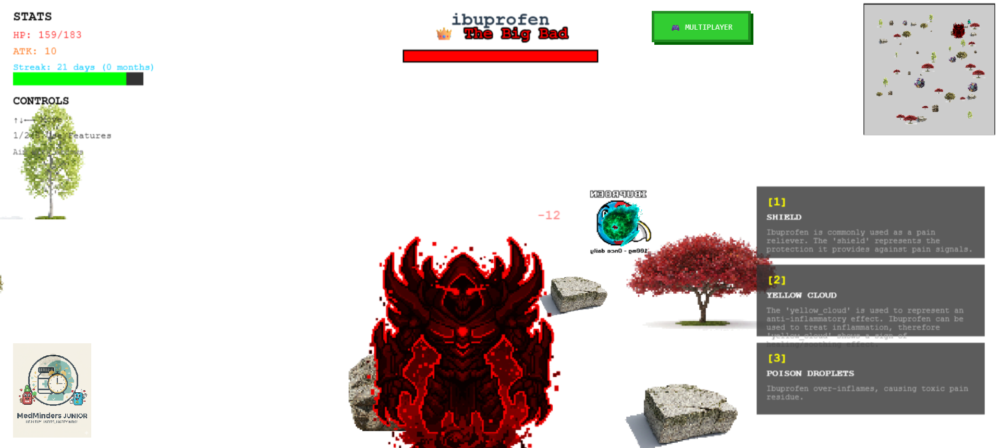

# MedMinders

## Inspiration
Each year, **125,000 lives are lost in the United States simply because medications are not taken as prescribed**. Medication mismanagement leads to preventable complications, hospitalizations, and dangerous drug interactions. We created **MedMinders** to address this problem and help people take their medications safely and consistently.

## What It Does
**MedMinders** is a secure and user-friendly platform designed to help individuals and families manage medications with confidence.  

The platform combines health management with **gamification**, turning medication adherence into an engaging experience rather than a chore. Users can track medications, receive guidance, and stay protected from dangerous drug interactions while interacting with an integrated game and AI-powered assistance.

## How We Built It
We built MedMinders using **Next.js** as the core framework for the web application. The project includes:

- A **frontend web interface** for user interaction
- A **backend system** to manage data and services
- A **fully integrated game** that gamifies medication adherence
- AI-powered features and secure data handling

## Challenges We Ran Into
One of our biggest challenges was **integrating the frontend and backend systems**. The process took around **12 hours of debugging, iteration, and troubleshooting** before everything communicated correctly. Despite the hurdles, persistence and teamwork helped us get everything running smoothly.

## Accomplishments That We're Proud Of
We are proud that **every major component of MedMinders is fully functional**, including:

- The chatbot
- The interactive game
- The frontend interface
- The backend infrastructure

Seeing all of these systems work together as a cohesive platform was a huge milestone.

## Built With
- Firebase  
- Gemini  
- Next.js  
- Python
